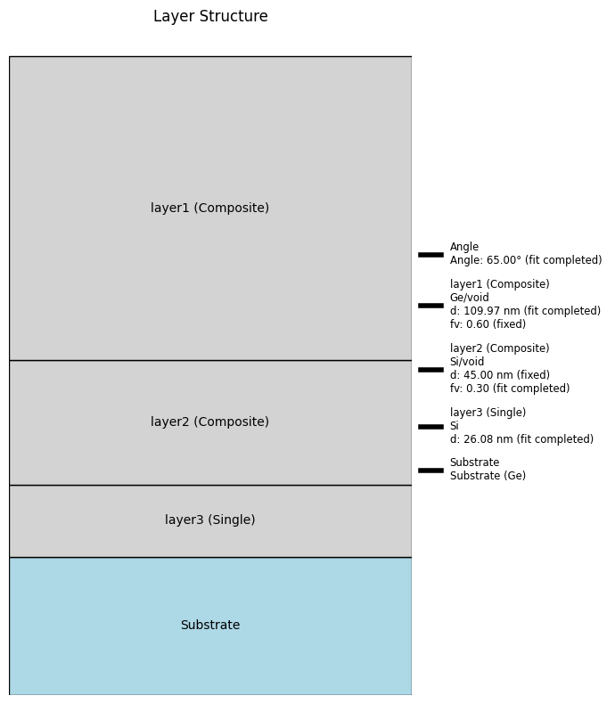
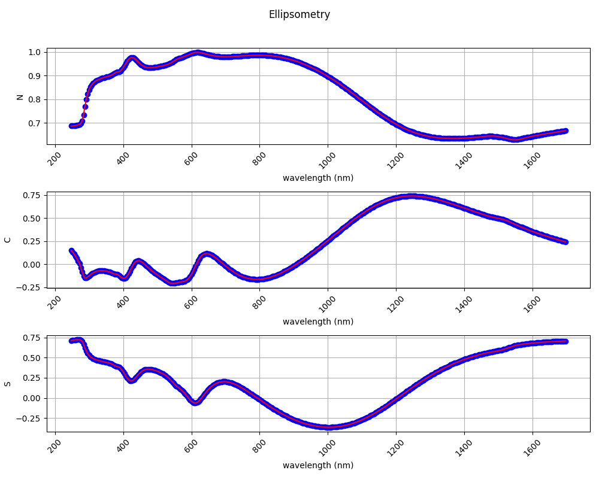

# Ellipsometry Data Fitting and Visualization

This project provides tools for fitting ellipsometry data using the `lmfit` library and visualizing the results. The project supports parallel processing and various material configurations, including composite materials.

## Features

- Fit ellipsometry data using `lmfit`
- Support for composite and single-layer materials
- Parallel processing (if sufficient free CPUs are available)
- Detailed visualization of the fitted layer structure and results

## Requirements

- Python 3.x
- Required Python packages: `numpy`, `matplotlib`, `lmfit`, `psutil`, `joblib`

## Transfer Matrix Method (TMM)

This project uses the `tmm` package to perform calculations using the Transfer Matrix Method (TMM). TMM is a computational technique commonly used in optics to model the propagation of light through layered media. It calculates the reflection and transmission coefficients of multilayer structures by solving Maxwell's equations in a piecewise manner.

### Features of TMM

- Calculation of reflection and transmission coefficients
- Support for multilayer structures
- Accurate modeling of optical properties of materials

## Installation

- Clone the repository:
    ```sh
    git clone https://github.com/ellipsometry-hu/incomplete_ease.git
    cd incomplete_ease
    ```
- Install Pipenv 
    ```bash
    pip install --upgrade pip
    pip install pipenv
    ```
- Install dependencies
    ```bash
    pipenv install
    ```
- Activate virtual environment
     ```bash
    pipenv shell
    ```

## Configuration

The configuration is provided via a `config.json` file. Here is an example configuration:

```json
{
    "wl_range": [250, 1700],
    "data_file": "txtfiles/experiment_data.txt",
    "material_layers": [
        {
            "name": "layer1",
            "type": "composite",
            "material1": "Ge",
            "material2": "void",
            "d": {"value": 100, "min": 90, "max": 300},
            "fv": {"value": 0.6, "min": 0, "max": 1}
        },
        {
            "name": "layer2",
            "type": "composite",
            "material1": "Si",
            "material2": "void",
            "d": {"value": 45, "min": 30, "max": 100},
            "fv": {"value": 0.4, "min": 0, "max": 1}
        },
        {
            "name": "layer3",
            "type": "single",
            "material": "Si",
            "d": {"value": 20, "min": 10, "max": 100}
        }

    ],
    "materials": {
        "Ge": {
            "file": "matfiles/Ge.mat"
        },
        "Si": {
            "file": "matfiles/Si_JAW2.mat"
        },
        "void": {
            "n": 1,
            "e": 1
        }
    },
    "substrate": "Ge",
    "angle": {"value": 70, "min": 60, "max": 80},
    "fit_method": "least_squares",
    "use_parallel": true,
    "fit_parameters": ["d_Si_layer3", "d_Ge_void_layer1", "fv_Si_void_layer2",  "angle"]
}

```

## Data File Format  

### Ellipsometry Data File (`txtfiles/experimental_data.txt`)
The ellipsometry data file should be a text file with three columns: wavelength(nm), Psi, and Delta at a specific angle of incidence. For example:


300 30.5 180.2  
305 30.7 179.8  
310 31.0 179.5  
...  


### Material File (`matfiles/Ge.mat`)

The material file should contain the wavelength (eV), and the real and imaginary parts of the dielectric function ($\epsilon_1$ and $\epsilon_2$).

For example, a .mat file should look like this:

9.7	    -2.99869025	1.34015852  
9.698	-3.00137768	1.34251625  
9.696	-2.99678901	1.34486965  
9.694	-3.00192702	1.34721763  
9.692	-3.00229582	1.34956127  
9.69	-3.00202929	1.35190166  
...  

## Program Execution

Run the main script with the configurationfile:
```bash
python main.py
```

## Output

### Fitted Layer Structure
  

### Ellipsometry Results

 

- [fit_report](fit_report.txt)
```txt
[[Fit Statistics]]
    # fitting method   = least_squares
    # function evals   = 40
    # data points      = 1089
    # variables        = 4
    chi-square         = 4.2812e-04
    reduced chi-square = 3.9458e-07
    Akaike info crit   = -16053.7958
    Bayesian info crit = -16033.8237
[[Variables]]
    d_Ge_void_layer1:   109.970347 +/- 0.00777737 (0.01%) (init = 100)
    fv_Ge_void_layer1:  0.6 (fixed)
    d_Si_void_layer2:   45 (fixed)
    fv_Si_void_layer2:  0.30043465 +/- 6.8920e-05 (0.02%) (init = 0.4)
    d_Si_layer3:        26.0752861 +/- 0.00916484 (0.04%) (init = 20)
    angle:              64.9985967 +/- 6.4996e-04 (0.00%) (init = 70)
[[Correlations]] (unreported correlations are < 0.100)
    C(fv_Si_void_layer2, d_Si_layer3)      = +0.9555
    C(d_Ge_void_layer1, d_Si_layer3)       = -0.9306
    C(d_Ge_void_layer1, fv_Si_void_layer2) = -0.9203
[[Latency]]
    time: 73.412363 seconds
    fit started: 2024-07-21 19:09:07
    fit ended: 2024-07-21 19:10:20

```

## TODO
- Add more ellipsometry methods like Rigorous Coupled-Wave Analysis (RCWA)
- Improve the user interface for configuring the fitting process
- Enhance parallel processing capabilities to handle larger datasets efficiently
- Handle materials and experimental data in different formats
Process data that contain variable angles